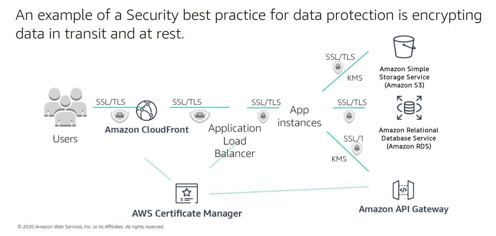

# Encryption on AWS

## Protection at rest
- client-side encryption: data is encrypted before sending it to AWS
- server-side encryption: data is enctypted on AWS after it's been received by the service

## Protection in transit
- end to end encryption using TLS
- IPsec with VPN

- [AWS KMS](../99_Services/AWS_KMS.md)
- [AWS Cloud HMS](../99_Services/AWS_Cloud_HMS.md)
- [AWS Certificate Manager](../99_Services/AWS_Certificate_Manager.md)
- [AWS Secrets_Manager](../99_Services/AWS_Secrets_Manager.md)

## Server-Side Encryption in S3

- Server-Side Encryption with Customer-Provided Keys (<strong>SSE-C</strong>)
    - requires use the AWS CLI, AWS SDK, or Amazon S3 REST API (no console)
    - customer is responsible for providing and managing keys
    - key must be provided with the data
    - AWS manages cryptographic operations
    - hash of the key is created when AWS encrypts the data and key is discarded
    - to decrypt the data, customer must provide the key, which will be compared with the hash and if match - data will be decrypted
      

- Server-Side Encryption with Amazon S3-Managed Keys (<strong>SSE-S3</strong>) (AES256)
    - AWS creates and manages keys and cryptographic operations
    - customer has no visibility or control over keys
    - S3 endpoint creates <strong>master key</strong>
        - every object in the bucket is encrypted with its own <strong>object key</strong>
        - object key is encrypted with the master key, ciphertext object key is stored with the encrypted object, and object key is discarded
    - <strong>NO ROLE SEPARATION </strong>
        - S3 admins have access to encryption operations
      

- Server-Side Encryption with Customer Master Keys (CMS) stored in AWS KMS (<strong>SSE-KMS</strong>)
    - <strong>master key</strong> (CMK) is managed in KMS
    - master key is used to encrypt object keys
    - ROLE SEPARATION
        - separates S3 admins from key admins, S3 admins can no longer perform crypto operations
      

Default Bucket Encryption
https://docs.aws.amazon.com/AmazonS3/latest/userguide/default-bucket-encryption.html