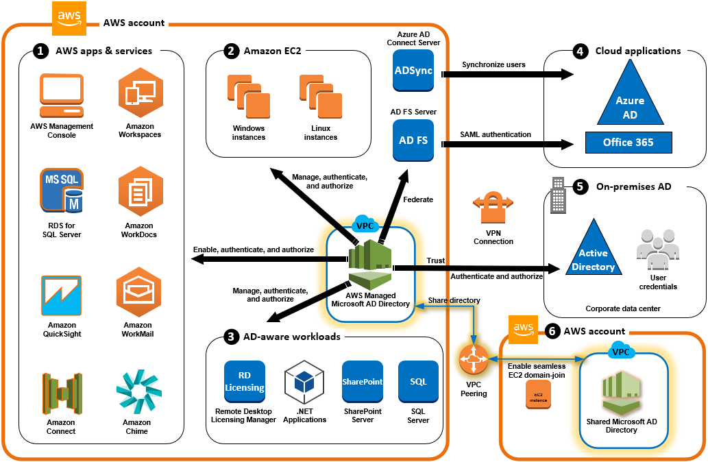

# AWS Directory Service

Managed service offering that provides directories containing organizations, users, groups, computers and other resources. 

Uses <strong>Microsoft Active Directory</strong> or <strong>Lightweight Directory Access Protocol (LDAP) </strong>

### AWS Managed Microsoft AD
- AWS Directory Service for Microsoft AD
- LDAP support for Linux applications

### Active Directory Connector
- allows on-prem users to log into AWS with their AD credentials
- can be used to join EC2 instances to AD Domain

### Simple Active Directory
- low cost AD that supports SMB or LDAP aware applications. 
- provides a subset of MS ADDS offerings