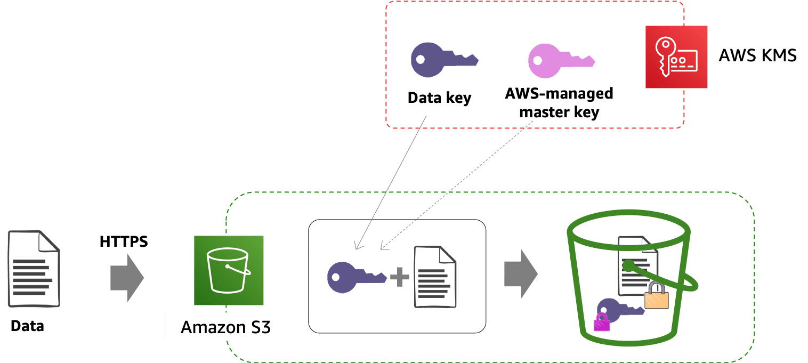

# AWS KMS

Key management service.

Allows to create and control keys used for cryptographic operations. 

Centralised key generation, storage, management and auditing.


1. Data is delivered to AWS via HTTPS. The service (here: S3) encrypts the data after it receives the API call.
2. KMS generates <strong>Data key</strong> and service (here: S3) uses it to ecrypt the data received. (In S3, each object will have its own unique data key.)
3. Data key is then ecrypted with <strong>customer master key (CMK)</strong>. AWS KMS tracks which master key was used to encrypt data key.
4. Encrypted data key is stored with the data so the service knows where to find it if data needs decrypting.


## Types of Customer Master Keys (CMK)

CMK - logical "container" for physical keys
- can only be used to encrypt up to 4KB of data
- regional (but can create <strong>multi-region keys</strong>) and public service
- symmetric and assymetric keys
- encrypt, decrypt operations
- keys <strong>never leave</strong> KMS
- FIPS 140-2 (L2) compliant
<br><br>

- AWS managed CMK
    - generated by AWS on customer's behalf
    - automatically rotated every 3 year 
    - can't be deleted
    - scope of use limited to specific AWS service
    - user access managed via AWS IAM policy

- Customer managed CMK
    - customer generated
    - rotated manually on demand or automatically once a year
    - can be deleted
    - scope of use controlled via AWS KMS or AWS IAM policy
    - user access managed via AWS IAM policy

CMK
- `CreateKey`
    - CMK is created, encrypted and then stored in KMS
- `Encrypt`
    - KMS decrypts CMK and uses it to encrypt the data, the key used for the operation in specified in ciphertext
- `Decrypt`
    - KMS identified CMK from ciphertext, decrypt CMK and use it to decrypt the data


DEK (Data Encryption Key)
- generated with CMK
- `GenerateDataKey` - works on data >4KB
- KMS doesn't store DEKs

    - use <strong>plaintext key</strong> to encrypt the data
    - encrypt the plaintext key with CMK
    - discard plaintext key
    - store <strong>ciphertext key</strong> with the encrypted data
    - when need to decrypt data, decrypt the ciphertext key


<br>
ROLE SEPARATION 
- use Key Policies and IAM Policies to separate duties (creating keys, encrypting, decrypting)
    - Define key administrative permissions - who can administer keys through the KMS API
    - Define key usage permissions 
        - select the IAM users and roles that can use the KMS key in cryptographic operations
        - other AWS accounts - administrators of those accounts are responsible for managing IAM permissions for IAM users and roles to use keys


```
echo "super secret text" > MY_FILE.txt

aws kms encrypt \
    --key-id alias/CHANGE_ME \
    --plaintext fileb://MY_FILE.txt \
    --output text \
    --query CiphertextBlob \
    | base64 --decode > MY_ENCRYPTED_FILE.enc 
    
aws kms decrypt \
    --ciphertext-blob fileb://MY_ENCRYPTED_FILE.enc \
    --output text \
    --query Plaintext | base64 --decode > MY_DECRYPTED_FILE.txt
```