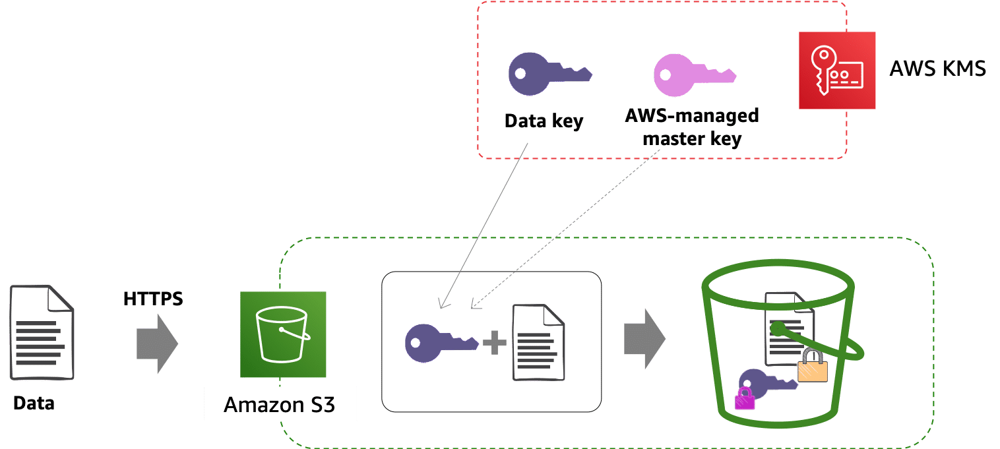

# AWS KMS

Key management service.

Allows to create and control keys used for cryptographic operations. 

Centralised key generation, storage, management and auditing.

1. Data is delivered to AWS via HTTPS. The service (here: S3) encrypts the data after it receives the API call.
2. KMS generates <strong>Data key</strong> and service (here: S3) uses it to ecrypt the data received. (In S3, each object will have its own unique data key.)
3. Data key is then ecrypted with <strong>customer master key (CMK)</strong>. AWS KMS tracks which master key was used to encrypt data key.
4. Encrypted data key is stored with the data so the service knows where to find it if data needs decrypting.

## Types of Customer Master Keys (CMK)
- AWS managed CMK
    - generated by AWS on customer's behaf
    - automatically rotated every 3 year 
    - can't be deleted
    - scope of use limited to specific AWS service
    - user access managed via AWS IAM policy

- Customer managed CMK
    - customer generated
    - rotated manually on demand or automatically once a year
    - can be deleted
    - scope of use controlled via AWS KMS or AWS IAM policy
    - user access managed via AWS IAM policy